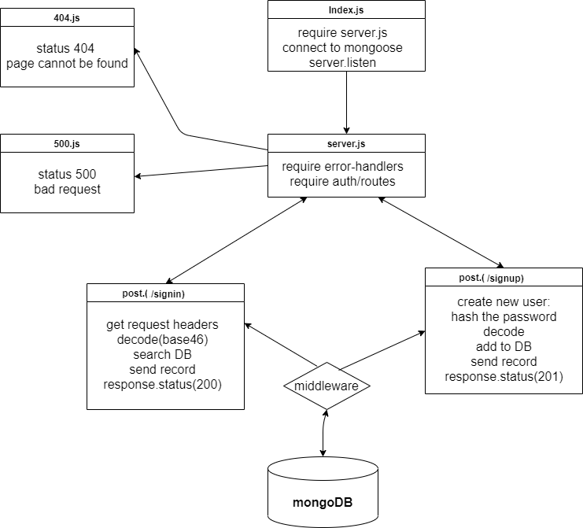

# basic-auth


## About 

 Project basically allow a user to create an account as well as to handle Basic Authentication (user provides a username + password). 

<hr>

## Author
Furat Malkawi

<hr>

## Links

* [Deployed App](https://basic-auth-furat.herokuapp.com)
* [Error Report](https://github.com/furatmalkawi29/basic-auth/actions)

<hr>

## Setup

1. `(.env)` file 

```
PORT = 4000

MONGOOSE_URI = mongodb://localhost:27017/things

MONGOOSE_TEST_URI = mongodb://localhost:27017/test

SECRET = (add your secret)

```

2. Install the following dependencies

```
npm init -y 

npm i cors dotenv express morgan mongoose base-64 bcrypt jsonwebtoken 

npm i -D jest supertest

npm i @code-fellows/supergoose 

mongod --dbpath=/Users/path/to/data/db


```

## Running the app 

1. clone the repo.

2. Enter the command `npm start`

3. Use endpoints :

   
  ### * `/signup`

<br>
  
- **Method** : POST 
- **Usage** : create a new user account using username and password 

- **Request body** : JSON 

```
{
    "username":"sara",
    "password":"123"
}
```

- **Response Body**  : JSON 
  
  
```
   {
        "_id": "60ad8bcbb3b5320fe8e0b6c4",
        "username": "gogo",
        "password": "$2b$10$L51wC4CihCjTnTw3nsHCaOLU68Y9ETu3jet03s8HRv5AEElVYlHOm",
        "__v": 0
    }
```


<br>


  ### * `/signin`

<br>
  
- **Method** : POST 
- **Usage** : Authenticate login credentials (username and password) 

- **Request headers authorization** :  submitted basic authentication credintial 

```

    username --> sara
    password --> 123

```

- **Response Body**  : JSON 
  
  
```
   {
    "user": {
        "_id": "60b53e323839523746758fb8",
        "username": "sara",
        "password": "$2b$05$o6RhejlEMlxUBIg.qy3gruo1rItWFsnFymX6F0TZdWq2/VrXLiYPm",
        "__v": 0
    }
}
```


4. Test .    

* In terminal run :

```
npm test
```
<br>
<hr>

## UML Diagram

<br>


